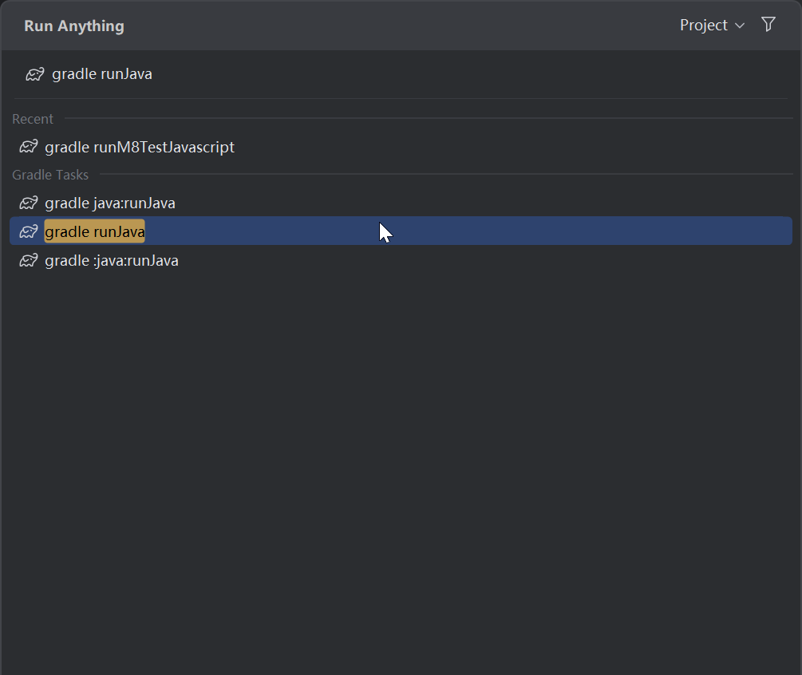
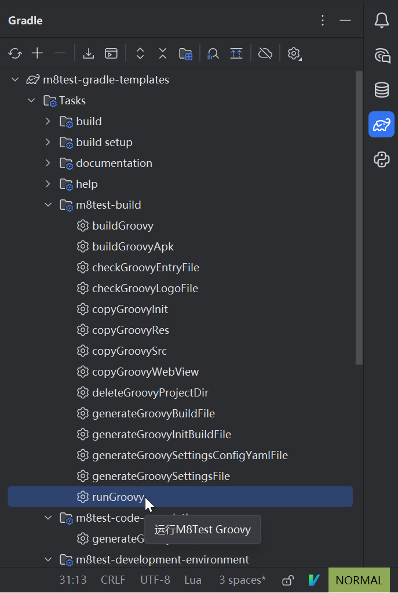
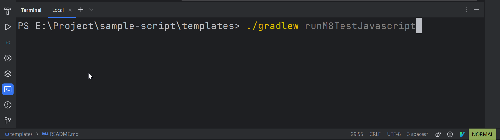

# [M8Test](https://dev-docs.m8test.com) Java Gradle 模板

> 如有疑问，请加入我们的官方 QQ 群：[749248182](https://qm.qq.com/q/jVVADJCAI8) 或 QQ
> 频道：[m8testofficial](https://pd.qq.com/s/8pidhywcy)

---

## 📦 Gradle 任务说明

### 任务分组

1. **`m8test-build`**  
   M8Test构建相关任务组，包含`buildJava`（构建Java项目）、`runJava`（运行项目）等任务。

2. **`m8test-code-completion`**  
   M8Test代码补全相关任务组，包含`generateJavaGlobalVariables`（生成全局变量代码补全文件）等任务。

3. **`m8test-developmenet-environment`**  
   M8Test开发环境相关任务组，包含`installDevelopmentEnvironment`（安装开发环境）、`installJavaPlugin`（安装语言插件）等任务。

4. **`m8test-download`**  
   M8Test资源下载相关任务组，包含`downloadJavaCodeTemplate`（下载示例代码模板）、`downloadJavaDocs`（下载文档）等任务。

> 实际开发中主要关注构建任务和代码补全任务即可。

### 常用任务

| 任务名称                          | 任务分组                     | 功能描述                                                         |
|-------------------------------|--------------------------|--------------------------------------------------------------|
| `generateJavaGlobalVariables` | `m8test-code-completion` | 生成Java全局变量代码补全文件，提供IDE代码提示功能。需连接安卓设备，建议编写代码前执行一次，依赖更新后需重新执行。 |
| `buildJava`                   | `m8test-build`           | 构建M8Test Java脚本项目源码（不执行），构建结果位于`build/project`目录。            |
| `runJava`                     | `m8test-build`           | 构建并将项目推送到已连接的安卓设备上运行。                                        |
| `buildJavaApk`                | `m8test-build`           | 将M8Test Java脚本项目打包成APK文件。                                    |

---

## 🚀 执行任务的方法

### 方法一：使用快捷搜索

1. 双击`Ctrl`键打开全局搜索框
2. 输入`gradle 任务名`（如`gradle runJava`）
3. 按回车执行



### 方法二：通过Gradle面板

1. 点击IDE右侧Gradle面板图标
2. 依次展开`java` > `Tasks` > `m8test`
3. 双击需要执行的任务



### 方法三：使用终端命令

1. 按`Alt + F12`打开终端
2. 输入命令`./gradlew 任务名`（如`./gradlew runJava`）
3. 按回车执行



---

## ⚙️ 配置脚本项目

脚本项目配置位于`java/build.gradle.kts`文件，可根据需要修改设备IP、ADB端口等参数，文件内包含详细注释可供参考。

---

## 🛠️ 项目开发流程

1. **生成全局变量**  
   执行`generateJavaGlobalVariables`任务生成代码补全文件，提供IDE代码提示功能。

2. **连接日志服务**  
   按`Alt + T`，依次选择`M8Test` > `连接日志服务`。

3. **编写并运行脚本**  
   编写代码保存后，执行`runJava`任务在安卓设备上运行项目（需提前开启ADB调试），运行日志可在M8Test日志面板查看。

   `runJava` 会先生成并推送 `build/project`（BuildProjectSource），等待 BuildScript 完成后，再启动独立的 Janino 项目入口脚本。`settings.config.yaml` 中的语言 `properties`（尤其是 `com.m8test.extension.id`）由语言 Gradle 插件生成。

4. **打包Apk**  
   所有的脚本开发工作都完整后, 如果你需要打包成独立的apk可以执行 `buildJavaApk` 任务。

## BuildProjectSource 与 SPA 目录

Java 模板的开发目录是：

```text
java/
├── build.gradle.kts       # Java/Janino Gradle 插件和项目配置
├── src/main/java/         # 带 package 的 IDE 源码，构建时转换为 .javas
├── src/main/resources/    # logo、自动启动标记等资源
├── webview/                # WebView 静态资源
└── build/                  # BuildProjectSource、构建中间产物和 SPA 输出
```

`runJava` 会把 Java 项目转换为 `build/project`，并推送为 Development Kit 的 BuildProjectSource。BuildScript 先执行 `settings.javas`、`init.build.javas` 和 `build.javas`，再生成 `project.config.json`；配置中的 `entry`、`sides` 相对于 `src/`。`.java` 文件用于代码提示，设备端执行文件使用 `.javas`，这是模板约定的 Java 脚本形式。

最终 SPA 的根目录不是 `build/spa/files`，后者只是临时 staging 目录。SPA 解包后应直接包含 `project.config.json`、`src/`、`init/`、`lib/`、`res/`、`webview/` 和可选的 `extension/`。

Java 入口使用 Janino 执行，并通过 `ComposeView` 创建脚本 UI。模板中的 `sides` 是独立 side 脚本入口；它们与主入口共享同一 Engine，但不会重复启动主项目。
