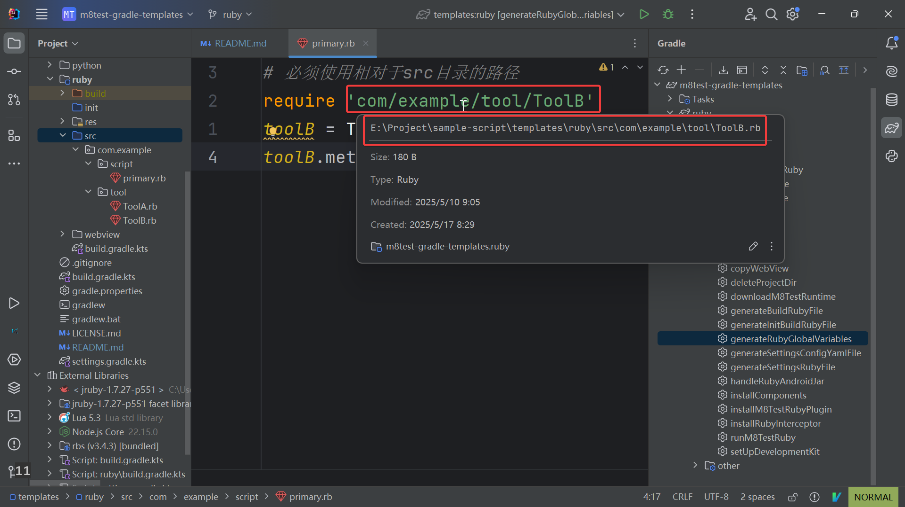

# [M8Test](https://dev-docs.m8test.com) Ruby Gradle 模板

> 如有疑问，请加入我们的官方 QQ 群：[749248182](https://qm.qq.com/q/jVVADJCAI8) 或 QQ
> 频道：[m8testofficial](https://pd.qq.com/s/8pidhywcy)

---

## 📦 Gradle 任务说明

1. **`buildM8TestRuby`**  
   构建 M8Test Ruby 脚本项目源码，但不执行脚本。构建完成后，源码位于 `build/project` 目录。

2. **`generateRubyGlobalVariables`**  
   生成 Ruby 全局变量，提供代码提示功能。需连接安卓设备，建议在编写代码前执行一次。如果 `build.gradle.kts`
   中的依赖组件更新，需重新执行。

3. **`handleRubyAndroidJar`**  
   生成 Android API 的 Ruby 代码提示文件。此任务耗时较长，执行一次即可。成功后，Ruby 代码中将有 Android API
   的代码提示。

4. **`installJRubyInterceptor`**  
   安装 JRuby 解析器。执行此任务会从网络下载 Ruby 并安装到 `~/.m8test/bin/jruby` 目录。若已安装 JRuby
   解析器，执行此任务不会重新安装。

5. **`runM8TestRuby`**  
   构建 M8Test Ruby 脚本项目，并将项目推送到已连接的安卓设备上运行。

---

## 🚀 执行任务的方法

### 方法一：使用快捷搜索

1. 双击 `Ctrl` 键，打开搜索框。
2. 输入 `gradle 任务名`，例如 `gradle runM8TestRuby`，然后按回车执行。

   

### 方法二：通过 Gradle 面板

1. 点击 Gradle 图标。
2. 依次展开 `ruby` > `Tasks` > `m8test`。
3. 双击需要执行的任务。

   

### 方法三：使用终端命令

1. 按下快捷键 `Alt + F12` 打开终端。
2. 输入命令 `./gradlew 任务名`，例如 `./gradlew runM8TestRuby`，然后按回车执行。

   

---

## ⚙️ 配置脚本项目

脚本项目的配置位于 `ruby/build.gradle.kts` 文件中。您可以根据需要修改设备的 IP、ADB 端口等参数。该文件中包含详细的代码注释，供参考。

---

## 🛠️ 项目开发流程

1. **生成全局变量**  
   执行 `generateRubyGlobalVariables` 任务，生成 Ruby 全局变量，提供代码提示功能。

2. **生成 Android API 提示文件**  
   执行 `handleRubyAndroidJar` 任务，生成 Android API 的 Ruby 代码提示文件。

3. **安装 Ruby 解析器**  
   执行 `installRubyInterceptor` 任务，安装 Ruby 解析器。

4. **配置 Ruby 解析器**

   如果项目没有配置ruby解析器就会出现下面的提示, 这时候可以点击 `configure`  

   

   点击 `Project` > `Sdk 右边的输入框` > `Add Sdk` > `JRuby Sdk`

   

   选择 `interceptor`

   

   找到jruby.exe的路径后点击 `Ok`, 如果是集成开发环境则在 `C:\Users\Your username\.m8test\bin\jruby\jruby.exe`

   

   可以看到jruby sdk成功添加, 点击`apply`

   

   选择 `Modules` > `ruby` > `Module Sdk 右边的输入框` > `选择jruby sdk`

   

   点击 `apply`

   

   再点击添加按钮

   

   选择 `JRuby`

   

   可以看到jruby添加成功, 点击 `apply` > `Ok`

   

   可以看到已经没有需要配置ruby解析器提示了

   

   如果 require 提示 `No such file to load`

   

   在 `Project` 视图中 `ruby/src` 目录下鼠标右键 > `Mark Directory as` > `Load Path Root`

   

   等待一下 require 就正常了

   

5. **连接日志服务**

   按下快捷键 `Alt + T`，依次选择 `M8Test` > `连接日志服务`。

6. **编写并运行脚本**

   编写代码并保存后，执行 `runM8TestRuby` 任务，即可在安卓设备上运行脚本项目。确保安卓设备已开启 ADB 调试。运行日志可在
   M8Test 日志面板中查看。
