# [M8Test](https://dev-docs.m8test.com) Python Gradle 模板

> 如有疑问，请加入我们的官方 QQ 群：[749248182](https://qm.qq.com/q/jVVADJCAI8) 或 QQ
> 频道：[m8testofficial](https://pd.qq.com/s/8pidhywcy)

---

## 📦 Gradle 任务说明

1. **`buildM8TestPython`**  
   构建 M8Test Python 脚本项目源码，但不执行脚本。构建完成后，源码位于 `build/project` 目录。

2. **`generatePythonGlobalVariables`**  
   生成 Python 全局变量，提供代码提示功能。需连接安卓设备，建议在编写代码前执行一次。如果 `build.gradle.kts`
   中的依赖组件更新，需重新执行。

3. **`handlePythonAndroidJar`**  
   生成 Android API 的 Python 代码提示文件。此任务耗时较长，执行一次即可。成功后，Python 代码中将有 Android API
   的代码提示。

4. **`installPythonInterceptor`**  
   安装 Python 解析器。执行此任务会从网络下载 Python 并安装到 `~/.m8test/bin/python` 目录。若已安装 Python
   解析器，执行此任务不会重新安装。

5. **`runM8TestPython`**  
   构建 M8Test Python 脚本项目，并将项目推送到已连接的安卓设备上运行。

---

## 🚀 执行任务的方法

### 方法一：使用快捷搜索

1. 双击 `Ctrl` 键，打开搜索框。
2. 输入 `gradle 任务名`，例如 `gradle runM8TestPython`，然后按回车执行。

   

### 方法二：通过 Gradle 面板

1. 点击 Gradle 图标。
2. 依次展开 `python` > `Tasks` > `m8test`。
3. 双击需要执行的任务。

   

### 方法三：使用终端命令

1. 按下快捷键 `Alt + F12` 打开终端。
2. 输入命令 `./gradlew 任务名`，例如 `./gradlew runM8TestPython`，然后按回车执行。

   

---

## ⚙️ 配置脚本项目

脚本项目的配置位于 `python/build.gradle.kts` 文件中。您可以根据需要修改设备的 IP、ADB 端口等参数。该文件中包含详细的代码注释，供参考。

---

## 🛠️ 项目开发流程

1. **生成全局变量**  
   执行 `generatePythonGlobalVariables` 任务，生成 Python 全局变量，提供代码提示功能。

2. **生成 Android API 提示文件**  
   执行 `handlePythonAndroidJar` 任务，生成 Android API 的 Python 代码提示文件。

3. **安装 Python 解析器**  
   执行 `installPythonInterceptor` 任务，安装 Python 解析器。

4. **配置 Python 解析器**

   如果项目没有配置python解析器就会出现下面的提示, 这时候可以点击 `configure python interceptor`  

   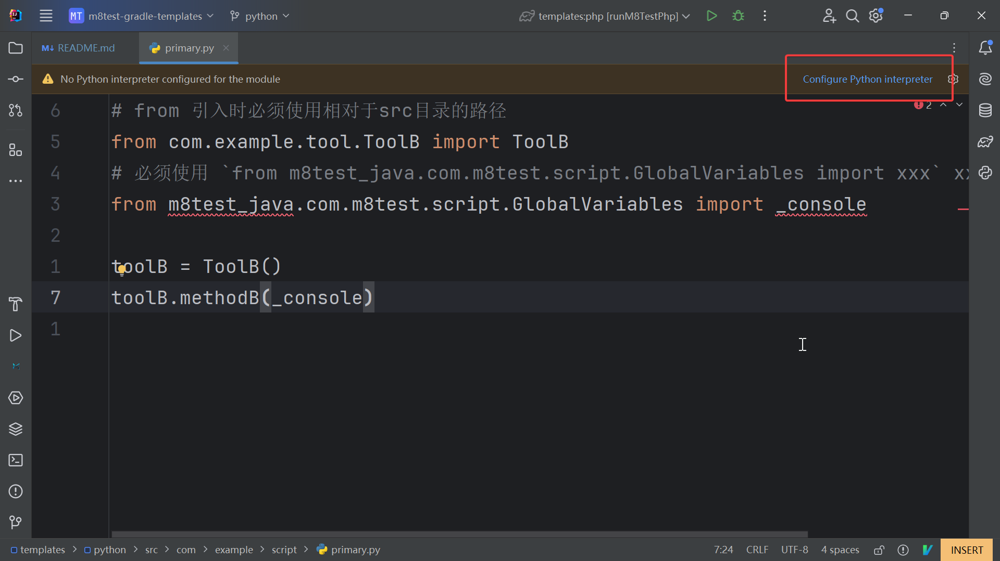

   点击 `Modules` > `python` > `添加按钮图标`

   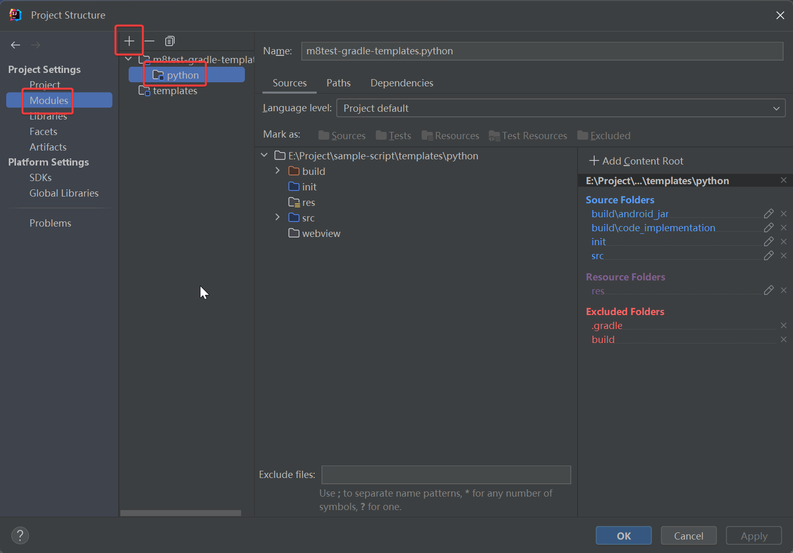

   选择 `python`

   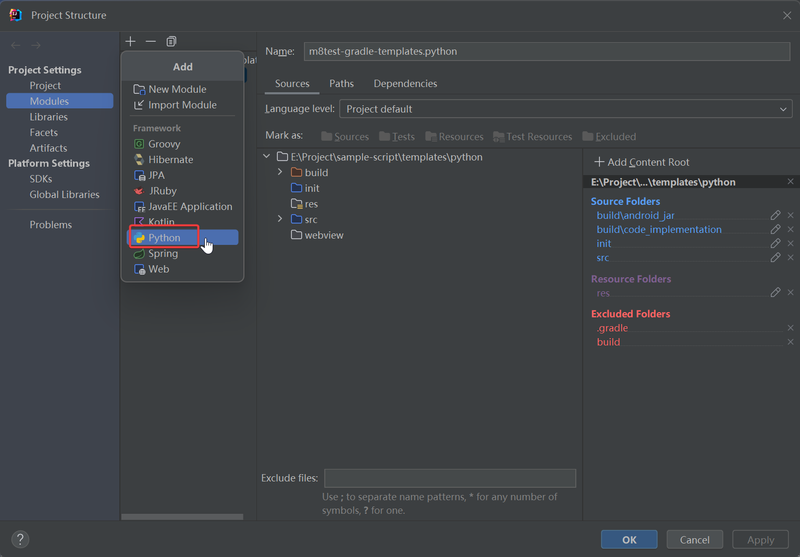

   点击三个点图标

   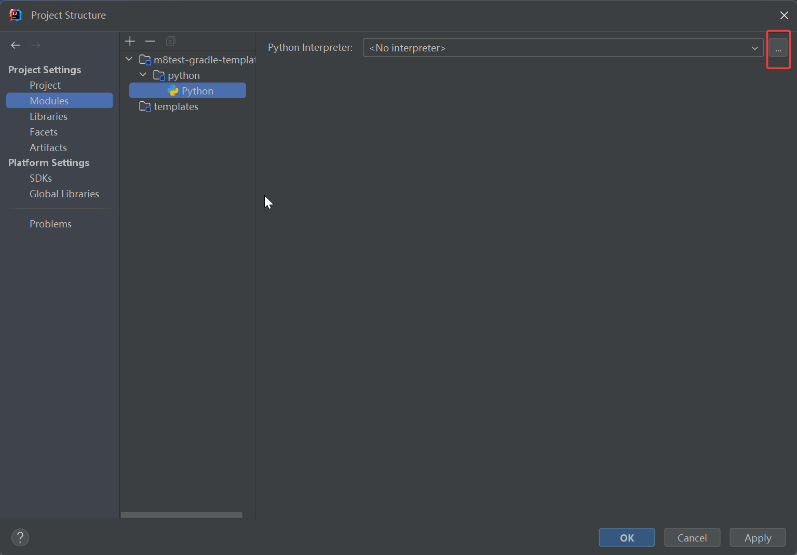

   点击添加按钮

   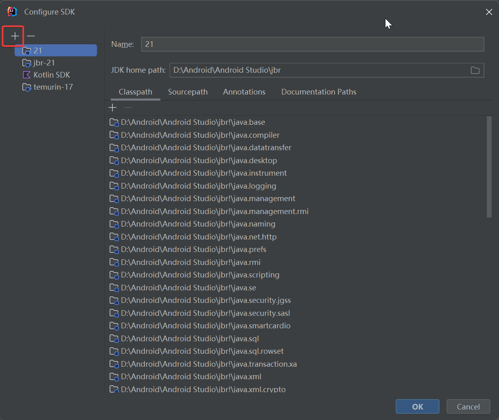

   选择 `Add Python Sdk`

   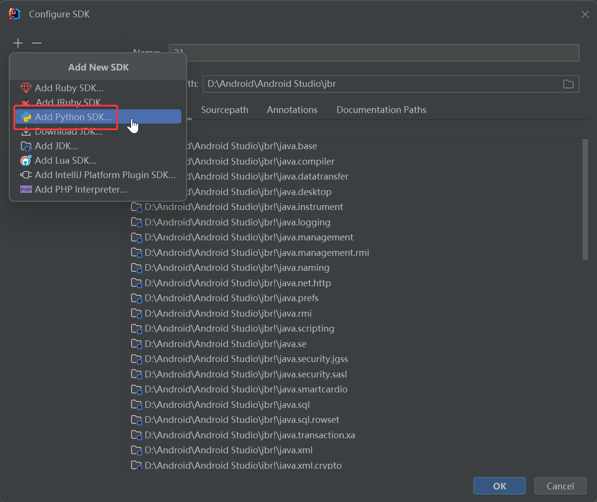

   选择 `System Interceptor` 后点击三个点按钮

   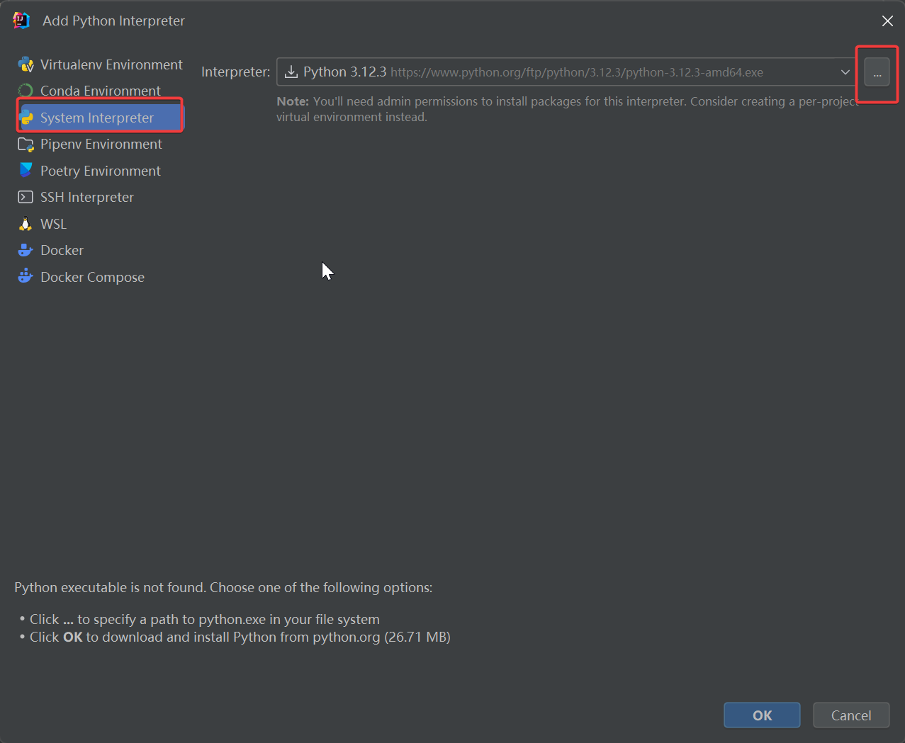

   选择python解析器(python.exe)的路径后点击 `Ok`,
   如果是集成开发环境则选择 `C:\Users\Your username\.m8test\bin\python\python.exe`

   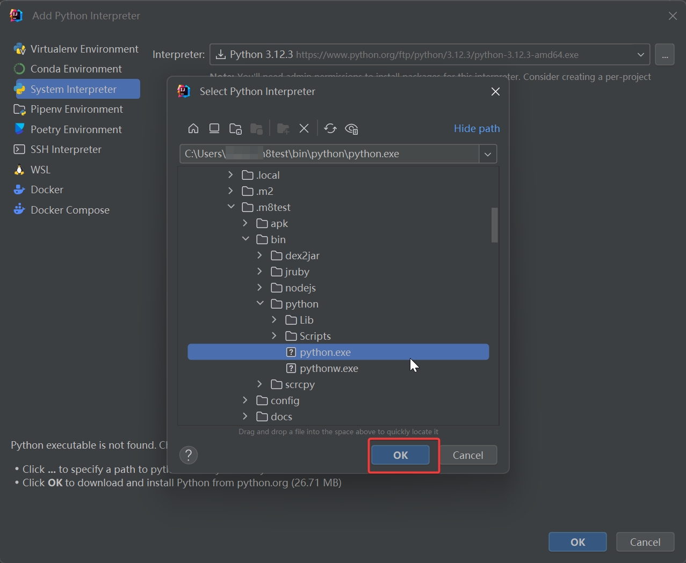

   添加解析器成功后点击 `Ok`

   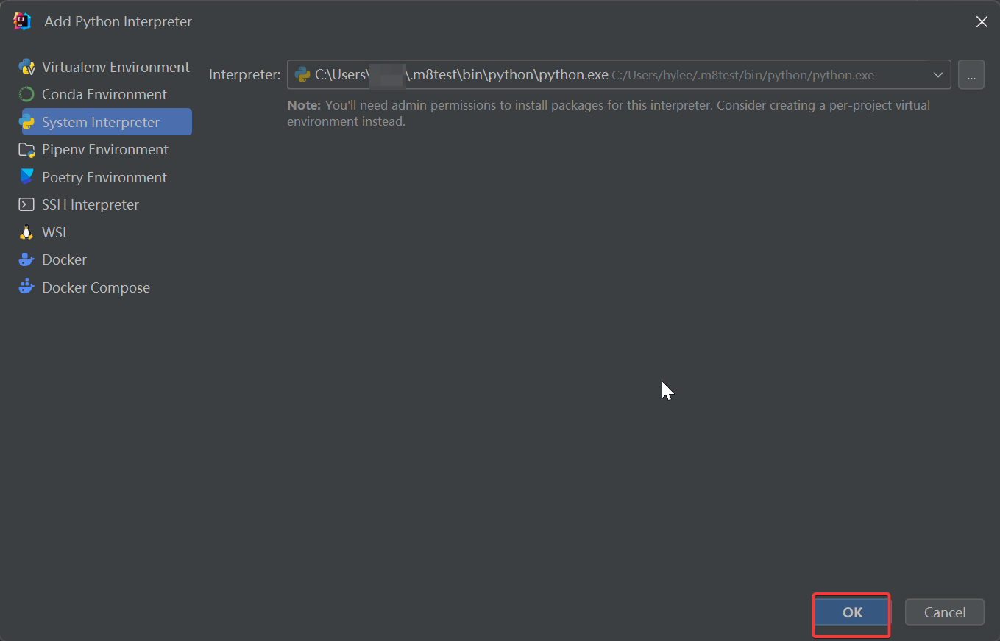

   可以看到python解析器添加成功, 继续点击 `Ok`

   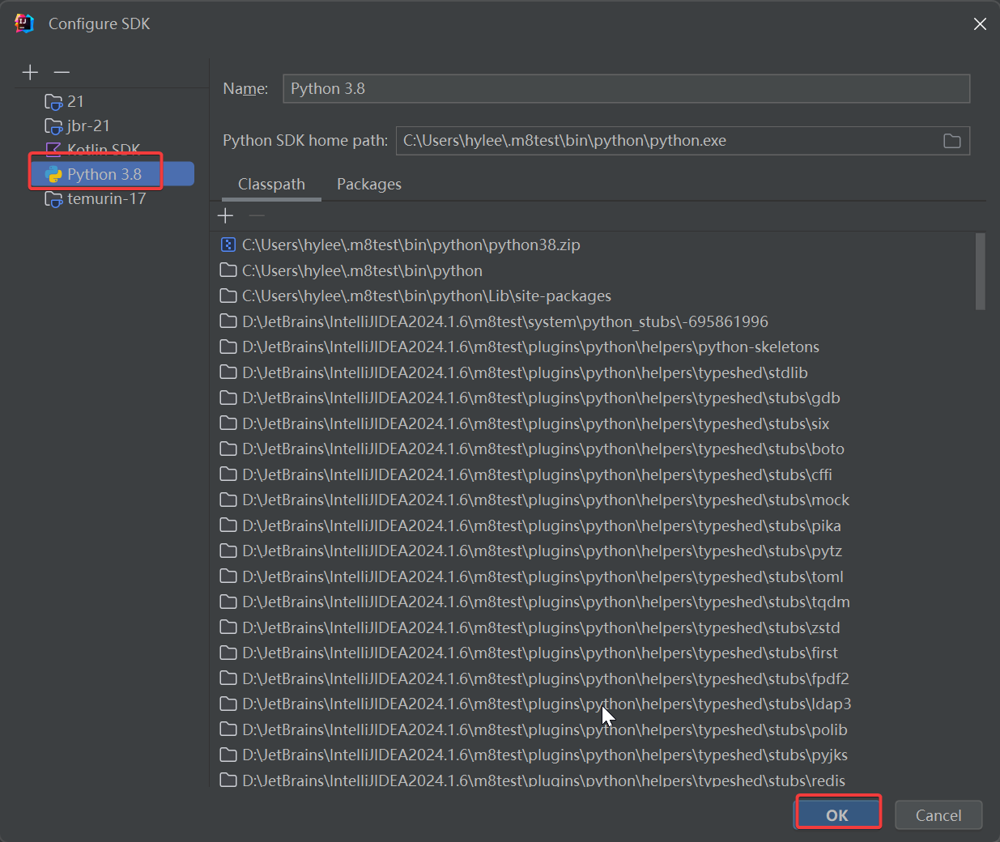

   点击 `Python Interceptor` 右边的输入框选择我们刚添加的python sdk

   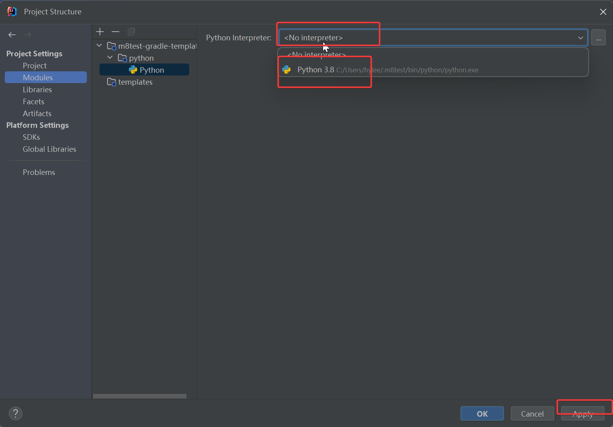

   点击 `apply` 再点击 `Ok`

   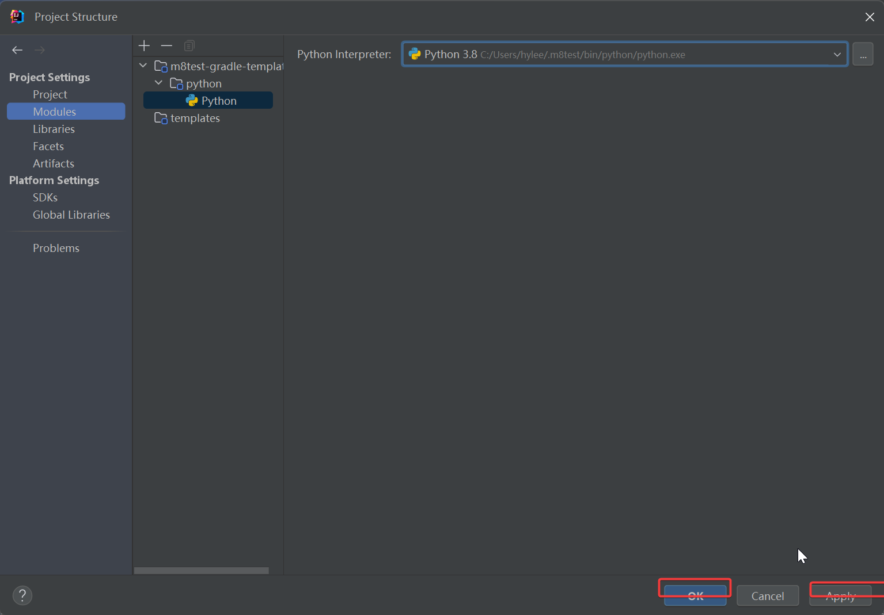

   我们再看一下python源码, 可以看到已经没有 `configure python interceptor` 的提示了

   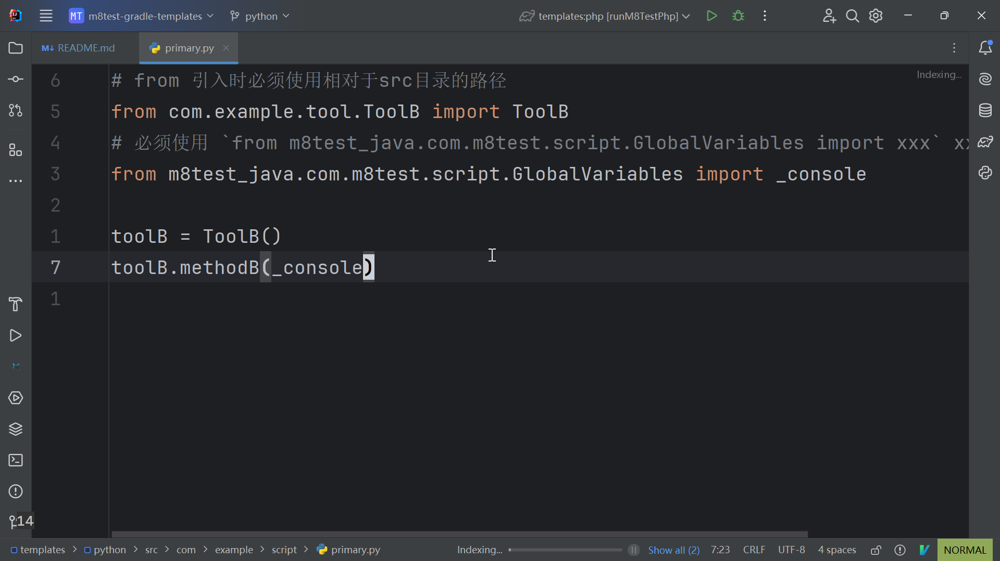

5. **连接日志服务**

   按下快捷键 `Alt + T`，依次选择 `M8Test` > `连接日志服务`。

6. **编写并运行脚本**

   编写代码并保存后，执行 `runM8TestPython` 任务，即可在安卓设备上运行脚本项目。确保安卓设备已开启 ADB 调试。运行日志可在
   M8Test 日志面板中查看。
